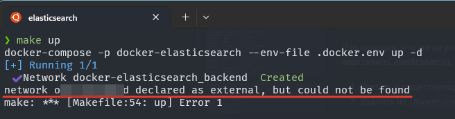
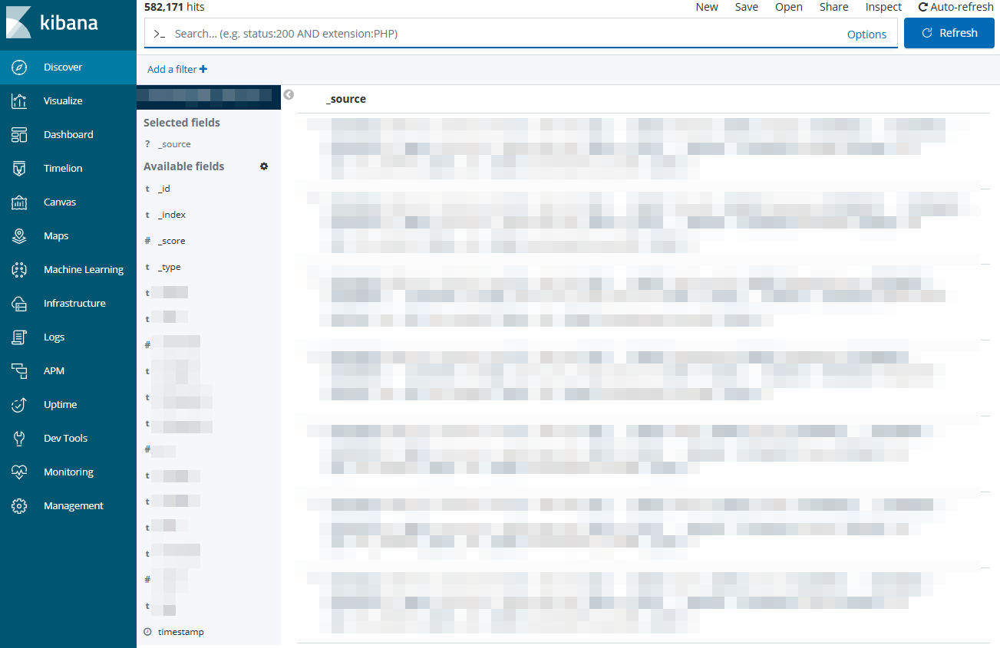

# Global Elasticsearch Stack

[](LICENSE)

## Sprache wählen:

| Russisch  | Englisch                              | Spanisch                             | Chinesisch                           | Französisch                           | **Deutsch**                           |
|-----------|--------------------------------------|--------------------------------------|-------------------------------------|--------------------------------------|--------------------------------------|
| [Русский](../README.md) | [English](./README_en.md) | [Español](./README_es.md) | [中文](./README_zh.md) | [Français](./README_fr.md) | **Ausgewählt** |

Dieses Projekt stellt einen einsatzbereiten `Elasticsearch + analysis-icu + analysis-phonetic + Kibana`-Stack mit einem `Nginx`-Reverse-Proxy für einfachen Zugriff bereit.

## 📋 Voraussetzungen

- Docker 20.10+ und Docker Compose 2.0+
- Mindestens 4 GB freier Arbeitsspeicher
- Die Ports 8080 und 9200 müssen auf dem Host verfügbar sein
- Bestehendes Docker-Netzwerk `external_network` (**falls nicht benötigt, aus docker-compose.yml entfernen**)

## 🗂 Projektstruktur

```
.
├── .docker.env (wird durch Befehl oder manuell erstellt)
├── .docker.env.example
├── .gitignore
├── docker-compose.yml
├── Makefile
├── README.md
├── langs
│   ├── ...lokalisierte README.md-Dateien...
├── assets
│   ├── ...Inhalte für README.md...
├── docker-configs
│   ├── elasticsearch
│   │   ├── Dockerfile
│   │   └── elasticsearch.yml
│   ├── kibana
│   │   ├── Dockerfile
│   │   ├── kibana.yml
│   │   └── wait-for-elastic.sh
│   └── nginx
│       ├── Dockerfile
│       └── default.conf.template
└── data
    ├── ...wird im Projekt in .env erstellt...
```

## ⚙️ Konfiguration

Wichtige Umgebungsvariablen (Datei `.docker.env`):

| Variable             | Standardwert         | Beschreibung                             |
|----------------------|----------------------|------------------------------------------|
| COMPOSE_PROJECT_NAME | elasticsearch        | Projektname                              |
| ELASTIC_VERSION      | latest               | Elasticsearch-Version                    |
| KIBANA_VERSION       | latest               | Kibana-Version                           |
| NGINX_VERSION        | latest               | Nginx-Version                            |
| ELASTIC_CONTAINER    | elasticsearch        | Name des Elasticsearch-Containers        |
| KIBANA_CONTAINER     | kibana               | Name des Kibana-Containers               |
| NGINX_CONTAINER      | nginx                | Name des Nginx-Containers                |
| KIBANA_DOMAIN        | kibana.local         | Domain für den Zugriff auf Kibana        |
| ELASTIC_DOMAIN       | elastic.local        | Domain für den Zugriff auf Elasticsearch |
| KIBANA_PORT          | 5601                 | Kibana-Port auf dem Host                 |
| ELASTIC_PORT         | 9200                 | Elasticsearch-Port auf dem Host          |
| NGINX_PORT           | 80                   | Nginx-Port auf dem Host                  |
| ELASTIC_DATA_DIR     | ./data/elasticsearch | Speicherort für Elasticsearch-Daten      |
| KIBANA_DATA_DIR      | ./data/kibana        | Speicherort für Kibana-Daten             |
| EXTERNAL_NETWORK     | external_network     | Externes Docker-Netzwerk                 |

## 🛠 Technische Details

- **Elasticsearch**:
    - Single-Node-Cluster
    - 2 GB RAM zugewiesen
    - Vorgefertigtes Plugin `analysis-icu`
    - Vorgefertigtes Plugin `analysis-phonetic`
    - Synonymkonfiguration über `synonyms.txt`
- **Kibana**:
    - Automatisches Warten auf die Bereitschaft von Elasticsearch
    - Reverse-Proxy-Konfiguration über Nginx
- **Nginx**:
    - Reverse-Proxy für Elasticsearch und Kibana

## 🚀 Schneller Start

### 1. Repository klonen

```bash
git clone https://github.com/yourusername/docker-elasticsearch.git
cd docker-elasticsearch
```

### 2. Umgebung initialisieren

Falls Sie Windows verwenden, sehen Sie sich die `Makefile`-Datei an, die eine vollständige Liste der Befehle enthält. Es wird empfohlen, entweder `Linux` oder `Windows + WSL` zu verwenden.

#### 2.1 .docker.env initialisieren

Befehl ausführen:

```makefile
make init
```

Dadurch wird eine `.docker.env`-Datei erstellt sowie die Verzeichnisse für die Speicherung von Dateien (`ELASTIC_DATA_DIR`, `KIBANA_DATA_DIR`).

#### 2.2 Elasticsearch-, Kibana- und Nginx-Images herunterladen

Befehl ausführen:

```makefile
make pull
```

Dies lädt die Images basierend auf den in `ELASTIC_VERSION`, `KIBANA_VERSION` und `NGINX_VERSION` angegebenen Versionen herunter.

#### 2.3 Projekt starten

Befehl ausführen:

```makefile
make up
```

Falls Sie auf den Fehler stoßen:

```text
network onex_backend declared as external, but could not be found
```



Das bedeutet, dass kein externes Netzwerk angegeben wurde (das Projekt-Netzwerk, mit dem Elasticsearch verbunden werden soll). Zwei Lösungen:

1. Ein bestehendes Netzwerk in `.docker.env` unter `EXTERNAL_NETWORK` angeben
2. Folgendes aus `docker-compose.yml` entfernen:

```
Für den Elasticsearch-Dienst:
- external_network

Für Netzwerke:
external_network:
  name: ${EXTERNAL_NETWORK}
  external: true
```

#### 2.4 Weitere Befehle

- Images ohne Cache bauen: `make build`
- Container stoppen: `make down`
- "Harter" Neustart: `make reset`
- "Weicher" Neustart: `make restart`
- In einen bestimmten Container wechseln: `make in <container>`
- Logs eines bestimmten Containers anzeigen: `make log <container>`

## 🔌 Zugriff auf die Dienste

Nach dem Start sind die Dienste über Nginx verfügbar:

- Kibana: http://`${KIBANA_DOMAIN}`:`${NGINX_PORT}`
- Elasticsearch: http://`${ELASTIC_DOMAIN}`:`${NGINX_PORT}`

Standardmäßig:

- Kibana: http://kibana.local:80
- Elasticsearch: http://elastic.local:80

**Vergessen Sie nicht, die Domains in der Hosts-Datei hinzuzufügen:**

* Für Windows: `C:\Windows\System32\drivers\etc\hosts`
* Für Linux: `/etc/hosts`

Beispiel:

```
127.0.0.1    elastic.local
127.0.0.1    kibana.local
```

# Ergebnis

Zugriff auf Elasticsearch über den Browser (http://elastic.local:80):


Zugriff auf Kibana über den Browser (http://kibana.local:80):





