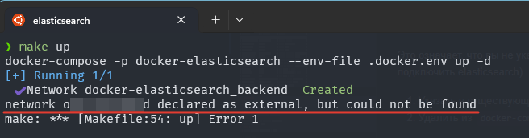
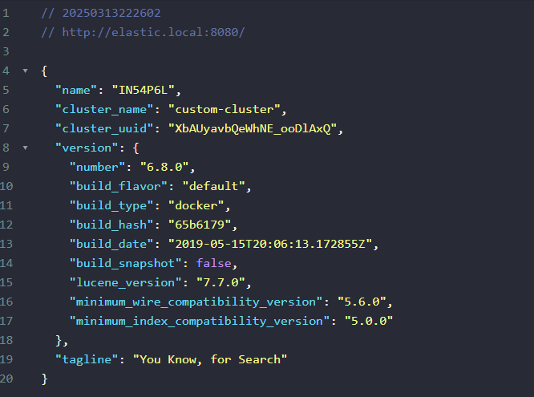
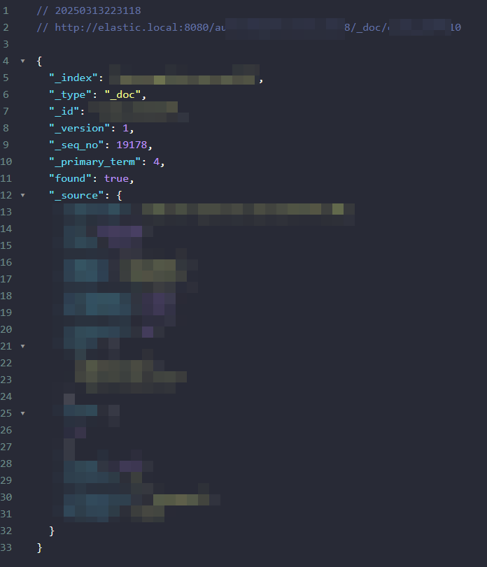
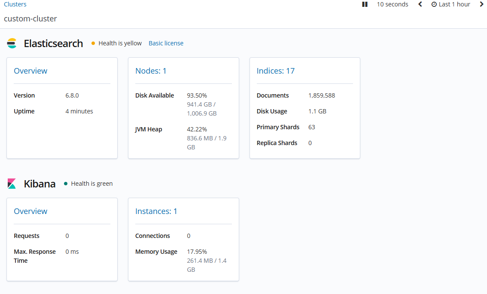
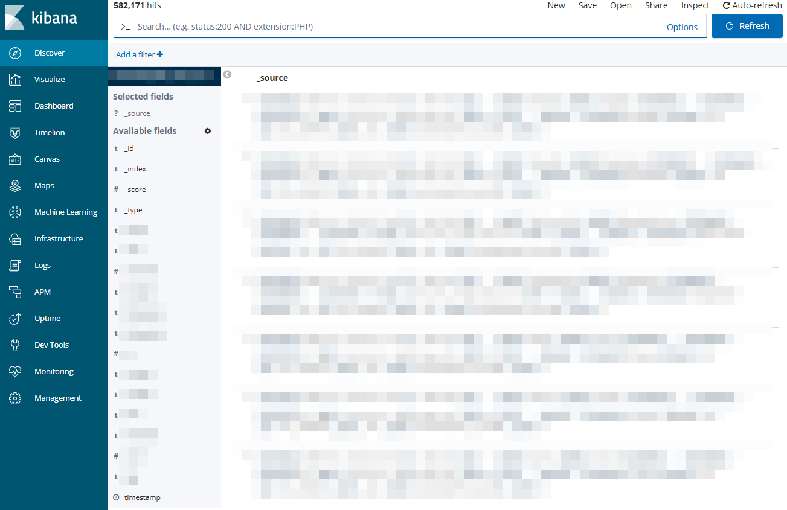
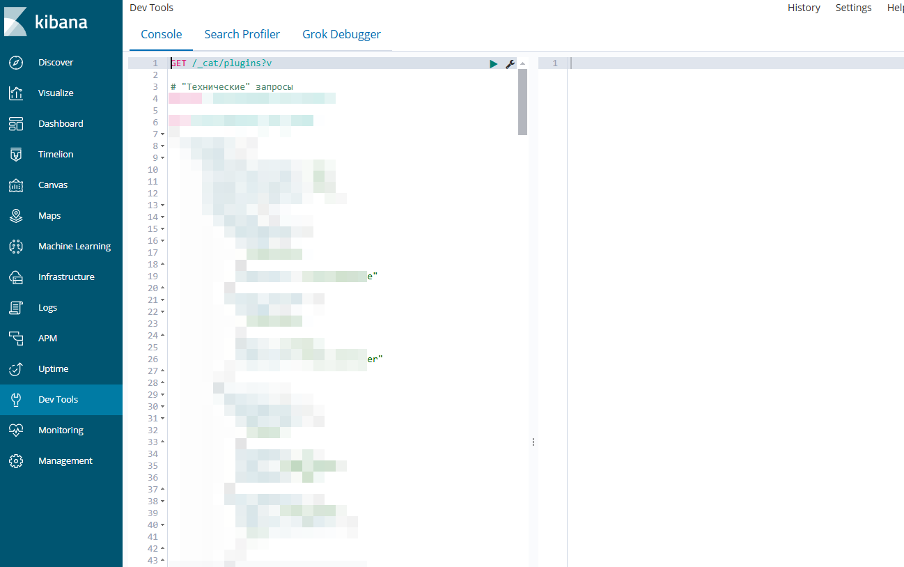

# Global Elasticsearch Stack

[](LICENSE)

## Select Language:

| Russian                 | **English**  | Spanish                   | Chinese              | French                     | German                    |
| ----------------------- | ------------ | ------------------------- | -------------------- | -------------------------- | ------------------------- |
| [Русский](../README.md) | **Selected** | [Español](./README_es.md) | [中文](./README_zh.md) | [Français](./README_fr.md) | [Deutsch](./README_de.md) |

This project provides a ready-to-use `Elasticsearch + analysis-icu + analysis-phonetic + Kibana` stack with an `Nginx` reverse proxy for easy access.

## 📋 Prerequisites

- Docker 20.10+ and Docker Compose 2.0+
- 4+ GB of free RAM
- Ports 8080 and 9200 must be available on the host
- Existing Docker network `external_network` (**remove from docker-compose.yml if not needed**)

## 🗂 Project Structure

```
.
├── .docker.env (created by command or manually)
├── .docker.env.example
├── .gitignore
├── docker-compose.yml
├── Makefile
├── README.md
├── langs
│   ├── ...localized README.md files...
├── assets
│   ├── ...content for README.md...
├── docker-configs
│   ├── elasticsearch
│   │   ├── Dockerfile
│   │   └── elasticsearch.yml
│   ├── kibana
│   │   ├── Dockerfile
│   │   ├── kibana.yml
│   │   └── wait-for-elastic.sh
│   └── nginx
│       ├── Dockerfile
│       └── default.conf.template
└── data
    ├── ...created for the project in .env...
```

## ⚙️ Configuration

Main environment variables (file `.docker.env`):

| Variable               | Default Value        | Description                        |
|------------------------|----------------------|------------------------------------|
| COMPOSE\_PROJECT\_NAME | elasticsearch        | Project name                       |
| ELASTIC\_VERSION       | latest               | Elasticsearch version              |
| KIBANA\_VERSION        | latest               | Kibana version                     |
| NGINX\_VERSION         | latest               | Nginx version                      |
| ELASTIC\_CONTAINER     | elasticsearch        | Elasticsearch container name       |
| KIBANA\_CONTAINER      | kibana               | Kibana container name              |
| NGINX\_CONTAINER       | nginx                | Nginx container name               |
| KIBANA\_DOMAIN         | kibana.local         | Domain for accessing Kibana        |
| ELASTIC\_DOMAIN        | elastic.local        | Domain for accessing Elasticsearch |
| KIBANA\_PORT           | 5601                 | Kibana port on the host            |
| ELASTIC\_PORT          | 9200                 | Elasticsearch port on the host     |
| NGINX\_PORT            | 80                   | Nginx port on the host             |
| ELASTIC\_DATA\_DIR     | ./data/elasticsearch | Elasticsearch data storage         |
| KIBANA\_DATA\_DIR      | ./data/kibana        | Kibana data storage                |
| EXTERNAL\_NETWORK      | external\_network    | External Docker network            |

## 🛠 Technical Details

- **Elasticsearch**:
    - Single-node cluster
    - Allocated 2GB RAM
    - Pre-installed `analysis-icu` plugin
    - Pre-installed `analysis-phonetic` plugin
    - Synonyms configuration via `synonyms.txt`
- **Kibana**:
    - Automatic wait for Elasticsearch readiness
    - Configured reverse proxy via Nginx
- **Nginx**:
    - Reverse proxy for Elasticsearch and Kibana

## 🚀 Quick Start

### 1. Clone the repository

```bash
git clone https://github.com/yourusername/docker-elasticsearch.git
cd docker-elasticsearch
```

### 2. Initialize the environment

If you are using Windows, check the `Makefile` for a full list of commands. It is recommended to use either `Linux` or `Windows + WSL`.

#### 2.1 Initialize .docker.env

Run:

```makefile
make init
```

This will create a `.docker.env` file and the directories for storing files (`ELASTIC_DATA_DIR`, `KIBANA_DATA_DIR`).

#### 2.2 Download Elasticsearch, Kibana, and Nginx images

Run:

```makefile
make pull
```

This will download images based on the versions specified in `ELASTIC_VERSION`, `KIBANA_VERSION`, `NGINX_VERSION`.

#### 2.3 Start the project

Run:

```makefile
make up
```

If you encounter an error:

```text
network onex_backend declared as external, but could not be found
```



This means you did not specify an external network (the project network that Elasticsearch should connect to). Two options:

1. Specify an existing network in `.docker.env` under `EXTERNAL_NETWORK`
2. Remove the following from `docker-compose.yml`:

```
For the elasticsearch service:
- external_network

For networks:
external_network:
  name: ${EXTERNAL_NETWORK}
  external: true
```

#### 2.4 Other commands

- Build images without cache: `make build`
- Stop containers: `make down`
- "Hard" restart: `make reset`
- "Soft" restart: `make restart`
- Enter a specific container: `make in <container>`
- View logs of a specific container: `make log <container>`

## 🔌 Service Access

After starting, services are available via Nginx:

- Kibana: http\://`${KIBANA_DOMAIN}`:`${NGINX_PORT}`
- Elasticsearch: http\://`${ELASTIC_DOMAIN}`:`${NGINX_PORT}`

By default:

- Kibana: [http://kibana.local:80](http://kibana.local:80)
- Elasticsearch: [http://elastic.local:80](http://elastic.local:80)

**Don't forget to add domains to the hosts file:**

- For Windows: `C:\Windows\System32\drivers\etc\hosts`
- For Linux: `/etc/hosts`

Example:

```
127.0.0.1    elastic.local
127.0.0.1    kibana.local
```

# Result

Access Elasticsearch via browser ([http://elastic.local:80](http://elastic.local:80)):





Access Kibana via browser ([http://kibana.local:80](http://kibana.local:80)):





