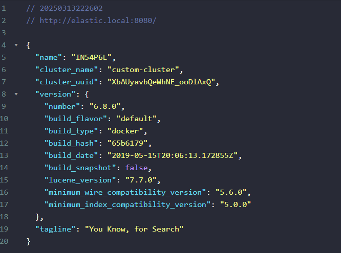
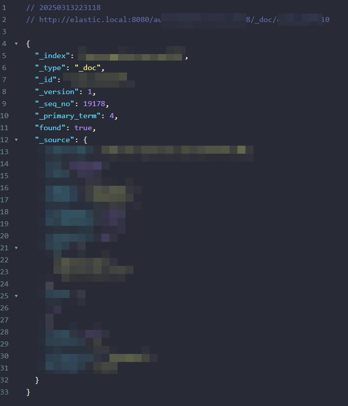

# Global Elasticsearch Stack

[](LICENSE)

## Elija Idioma:

| Русский                                                     | English                   | Español                              | 中文                              | Français                              | Deutsch                              |
|-------------------------------------------------------------|---------------------------|--------------------------------------|---------------------------------|---------------------------------------|--------------------------------------|
| [Русский](../README.md) | [English](./README_en.md) | **Seleccionado** | [中文](./README_zh.md) | [Français](./README_fr.md) | [Deutsch](./README_de.md) |

El proyecto proporciona un stack listo para usar con `Elasticsearch + analysis-icu + analysis-phonetic + Kibana` y un proxy inverso `Nginx` para un acceso conveniente.

## 📋 Requisitos previos

- Docker 20.10+ y Docker Compose 2.0+
- 4+ GB de memoria RAM disponible
- Puertos 8080 y 9200 libres en el host
- Red Docker existente `external_network` (**si no es necesario, elimínelo de docker-compose.yml**)

## 🗂 Estructura del proyecto

```
.
├── .docker.env (creado por el comando o manualmente)
├── .docker.env.example
├── .gitignore
├── docker-compose.yml
├── Makefile
├── README.md
├── langs
│   ├── ...archivos de localización README.md...
├── assets
│   ├── ...contenido para README.md...
├── docker-configs
│   ├── elasticsearch
│   │   ├── Dockerfile
│   │   └── elasticsearch.yml
│   ├── kibana
│   │   ├── Dockerfile
│   │   ├── kibana.yml
│   │   └── wait-for-elastic.sh
│   └── nginx
│       ├── Dockerfile
│       └── default.conf.template
└── data
├── ...creado para el proyecto en .env...
```

## ⚙️ Configuración

Las principales variables de entorno (archivo `.docker.env`):

| Variable             | Valor por defecto    | Descripción                          |
|----------------------|----------------------|--------------------------------------|
| COMPOSE_PROJECT_NAME | elasticsearch        | Nombre del proyecto                  |
| ELASTIC_VERSION      | latest               | Versión de Elasticsearch             |
| KIBANA_VERSION       | latest               | Versión de Kibana                    |
| NGINX_VERSION        | latest               | Versión de Nginx                     |
| ELASTIC_CONTAINER    | elasticsearch        | Nombre del contenedor elasticsearch  |
| KIBANA_CONTAINER     | kibana               | Nombre del contenedor kibana         |
| NGINX_CONTAINER      | nginx                | Nombre del contenedor nginx          |
| KIBANA_DOMAIN        | kibana.local         | Dominio para acceder a Kibana        |
| ELASTIC_DOMAIN       | elastic.local        | Dominio para acceder a Elasticsearch |
| KIBANA_PORT          | 5601                 | Puerto de Kibana en el host          |
| ELASTIC_PORT         | 9200                 | Puerto de Elasticsearch en el host   |
| NGINX_PORT           | 80                   | Puerto de Nginx en el host           |
| ELASTIC_DATA_DIR     | ./data/elasticsearch | Directorio de datos de Elasticsearch |
| KIBANA_DATA_DIR      | ./data/kibana        | Directorio de datos de Kibana        |
| EXTERNAL_NETWORK     | external_network     | Red externa de Docker                |

## 🛠 Detalles técnicos

- **Elasticsearch**:
    - Clúster de nodo único
    - 2GB de RAM asignados
    - El plugin `analysis-icu` está preinstalado
    - El plugin `analysis-phonetic` está preinstalado
    - Configuración con sinónimos a través de `synonyms.txt`
- **Kibana**:
    - Espera automática de la disponibilidad de Elasticsearch
    - Proxy configurado a través de Nginx
- **Nginx**:
    - Proxy inverso para Elasticsearch y Kibana

## 🚀 Inicio rápido

### 1. Clonar el repositorio

```bash
git clone https://github.com/yourusername/docker-elasticsearch.git
cd docker-elasticsearch
```

### 2. Inicializar el entorno

Si usas Windows, consulta el archivo `Makefile` para ver una descripción completa de los comandos. Se recomienda usar `Linux` o `Windows + WSL`.

#### 2.1 Inicializar `.docker.env`

Ejecuta:

```makefile
make init
```

Se creará el archivo `.docker.env`, así como los directorios donde se almacenarán los archivos (especificados en las variables: `ELASTIC_DATA_DIR`, `KIBANA_DATA_DIR`).

#### 2.2 Descargar las imágenes de Elasticsearch, Kibana, Nginx

Ejecuta:

```makefile
make pull
```

Se descargarán las imágenes con las versiones especificadas en `ELASTIC_VERSION`, `KIBANA_VERSION`, `NGINX_VERSION`.

#### 2.3 Iniciar el proyecto

Ejecuta:

```makefile
make up
```

Si aparece el siguiente error durante el inicio:

```text
network onex_backend declared as external, but could not be found
```


Esto significa que no has especificado una red externa (la red del proyecto a la que debe conectarse Elasticsearch). Hay dos opciones:

1. Especificar la red existente en `.docker.env`, configurando el parámetro `EXTERNAL_NETWORK`
2. Eliminarlo de `docker-compose.yml`
```
En el servicio de Elasticsearch:
- external_network

En networks:
external_network:
name: ${EXTERNAL_NETWORK}
external: true
```

#### 2.4 Otros comandos

- Construir imágenes sin caché: `make build`
- Detener los contenedores: `make down`
- Reinicio "fuerte": `make reset`
- Reinicio "suave": `make restart`
- Entrar en el contenedor necesario: `make in <container>`
- Ver los registros del contenedor necesario: `make log <container>`

## 🔌 Acceso a los servicios

Después de iniciar los servicios, estarán disponibles a través de Nginx:

- Kibana: http://`${KIBANA_DOMAIN}`:`${NGINX_PORT}`
- Elasticsearch: http://`${ELASTIC_DOMAIN}`:`${NGINX_PORT}`

Por defecto:

- Kibana: http://kibana.local:80
- Elasticsearch: http://elastic.local:80

**No olvides agregar los dominios a tu archivo hosts**:

* En Windows: `C:\Windows\System32\drivers\etc\hosts`
* En Linux: `/etc/hosts`

Ejemplo:

```
127.0.0.1    elastic.local
127.0.0.1    kibana.local
```

# Resultado

Acceso a Elasticsearch a través del navegador (http://elastic.local:80):





Acceso a Kibana a través del navegador (http://kibana.local:80):


