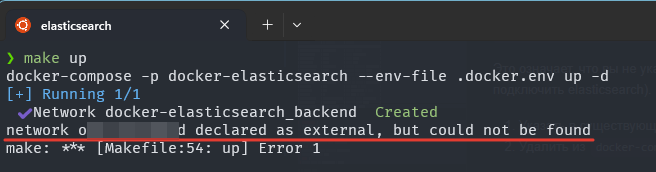
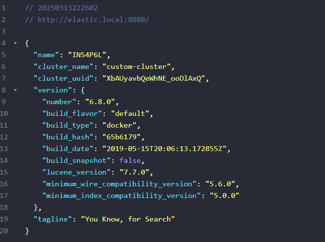
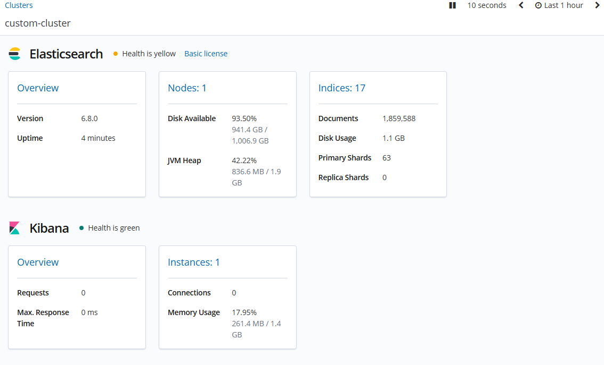
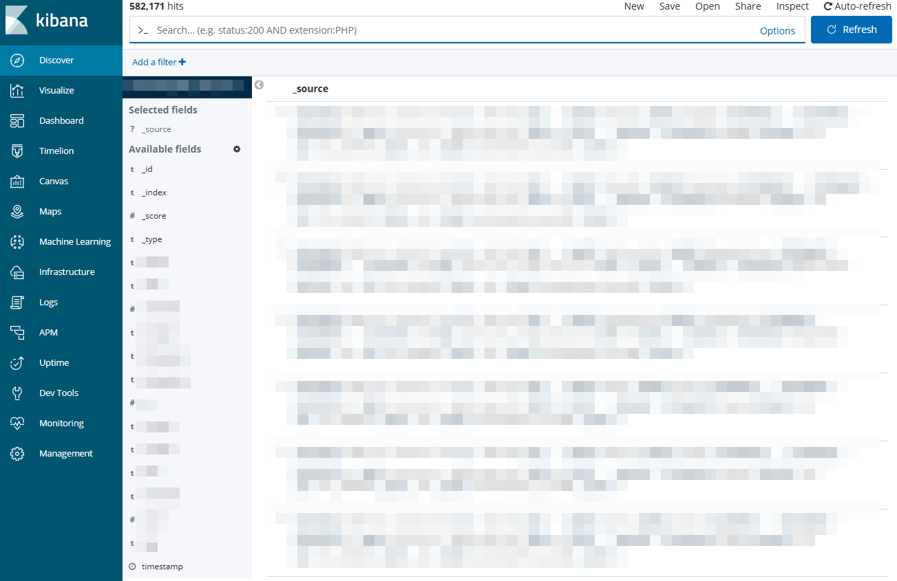
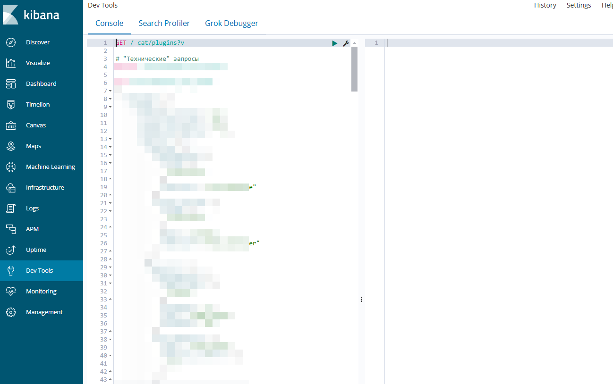

# Global Elasticsearch Stack

[](https://github.com/yaleksandr89/docker-elasticsearch)
[](https://www.elastic.co/elasticsearch)
[](https://www.elastic.co/kibana)
[](https://nginx.org/)
[](https://www.docker.com/)
[](../LICENSE.md)

## 选择语言:

| Русский  | English                              | Español                              | 中文                              | Français                              | Deutsch                              |
|-----------|--------------------------------------|--------------------------------------|-------------------------------------|--------------------------------------|--------------------------------------|
| [Русский](../README.md) | [English](./README_en.md) | [Español](./README_es.md) | **已选** | [Français](./README_fr.md) | [Deutsch](./README_de.md) |

该项目提供一个准备好的堆栈，包括 `Elasticsearch + analysis-icu + analysis-phonetic + Kibana` 和一个反向代理 `Nginx`，以便于访问。

## 📋 前提条件

- Docker 20.10+ 和 Docker Compose 2.0+
- 至少 4 GB 的可用内存
- 主机上 8080 和 9200 端口应为空闲
- 存在 Docker 外部网络 `external_network`（**如果不需要，应该从 docker-compose.yml 中删除**）

## 🗂 项目结构

```
.
├── .docker.env (通过命令或手动创建)
├── .docker.env.example
├── .gitignore
├── docker-compose.yml
├── Makefile
├── README.md
├── langs
│   ├── ...本地化的 README.md 文件...
├── assets
│   ├── ...README.md 的内容...
├── docker-configs
│   ├── elasticsearch
│   │   ├── Dockerfile
│   │   └── elasticsearch.yml
│   ├── kibana
│   │   ├── Dockerfile
│   │   ├── kibana.yml
│   │   └── wait-for-elastic.sh
│   └── nginx
│       ├── Dockerfile
│       └── default.conf.template
└── data
├── ...在 .env 中为项目创建...
```

## ⚙️ 配置

主要的环境变量（`.docker.env` 文件）：

| 变量名                  | 默认值                  | 描述                    |
|----------------------|----------------------|-----------------------|
| COMPOSE_PROJECT_NAME | elasticsearch        | 项目名称                  |
| ELASTIC_VERSION      | latest               | Elasticsearch 版本      |
| KIBANA_VERSION       | latest               | Kibana 版本             |
| NGINX_VERSION        | latest               | Nginx 版本              |
| ELASTIC_CONTAINER    | elasticsearch        | Elasticsearch 容器名称    |
| KIBANA_CONTAINER     | kibana               | Kibana 容器名称           |
| NGINX_CONTAINER      | nginx                | Nginx 容器名称            |
| KIBANA_DOMAIN        | kibana.local         | 访问 Kibana 的域名         |
| ELASTIC_DOMAIN       | elastic.local        | 访问 Elasticsearch 的域名  |
| KIBANA_PORT          | 5601                 | 主机上 Kibana 的端口        |
| ELASTIC_PORT         | 9200                 | 主机上 Elasticsearch 的端口 |
| NGINX_PORT           | 80                   | 主机上 Nginx 的端口         |
| ELASTIC_DATA_DIR     | ./data/elasticsearch | Elasticsearch 数据存储目录  |
| KIBANA_DATA_DIR      | ./data/kibana        | Kibana 数据存储目录         |
| EXTERNAL_NETWORK     | external_network     | Docker 外部网络           |

## 🛠 技术细节

- **Elasticsearch**:
    - 单节点集群
    - 分配了 2 GB 内存
    - 预安装了 `analysis-icu` 插件
    - 预安装了 `analysis-phonetic` 插件
    - 通过 `synonyms.txt` 配置同义词
- **Kibana**:
    - 自动等待 Elasticsearch 就绪
    - 通过 Nginx 配置代理
- **Nginx**:
    - Elasticsearch 和 Kibana 的反向代理

## 🚀 快速开始

### 1. 克隆仓库

```bash
git clone https://github.com/yourusername/docker-elasticsearch.git
cd docker-elasticsearch
```

### 2. 初始化环境

如果你使用的是 Windows，请查看 `Makefile` 文件，它包含了所有命令的详细说明。推荐使用 `Linux` 或 `Windows + WSL`。

#### 2.1 初始化 `.docker.env`

执行：

```makefile
make init
```

将会创建 `.docker.env` 文件，并创建存储文件的目录（在 `ELASTIC_DATA_DIR` 和 `KIBANA_DATA_DIR` 变量中指定）。

#### 2.2 拉取 Elasticsearch、Kibana、Nginx 镜像

执行：

```makefile
make pull
```

将拉取在 `ELASTIC_VERSION`、`KIBANA_VERSION`、`NGINX_VERSION` 中指定的版本的镜像。

#### 2.3 启动项目

执行：

```makefile
make up
```

如果在启动过程中出现错误：

```text
network onex_backend declared as external, but could not be found
```



这意味着你没有指定外部网络（Elasticsearch 需要连接的项目网络）。有两种解决方法：

1. 在 `.docker.env` 中指定现有的网络，设置 `EXTERNAL_NETWORK` 参数
2. 从 `docker-compose.yml` 中删除该项
```
在 Elasticsearch 服务中：
- external_network

在 networks 中：
external_network:
name: ${EXTERNAL_NETWORK}
external: true
```

#### 2.4 其他命令

- 构建镜像时不使用缓存：`make build`
- 停止容器：`make down`
- 强制重启：`make reset`
- 软重启：`make restart`
- 进入指定容器：`make in <container>`
- 查看指定容器的日志：`make log <container>`

## 🔌 访问服务

启动后，可以通过 Nginx 访问服务：

- Kibana: http://`${KIBANA_DOMAIN}`:`${NGINX_PORT}`
- Elasticsearch: http://`${ELASTIC_DOMAIN}`:`${NGINX_PORT}`

默认：

- Kibana: http://kibana.local:80
- Elasticsearch: http://elastic.local:80

**不要忘记在你的 hosts 文件中添加域名**：

* Windows 下：`C:\Windows\System32\drivers\etc\hosts`
* Linux 下：`/etc/hosts`

示例：

```
127.0.0.1    elastic.local
127.0.0.1    kibana.local
```

# 结果

通过浏览器访问 Elasticsearch (http://elastic.local:80)：




通过浏览器访问 Kibana (http://kibana.local:80)：





